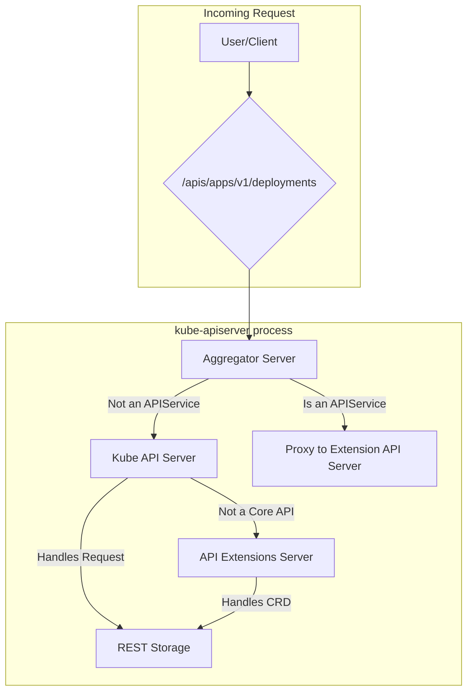
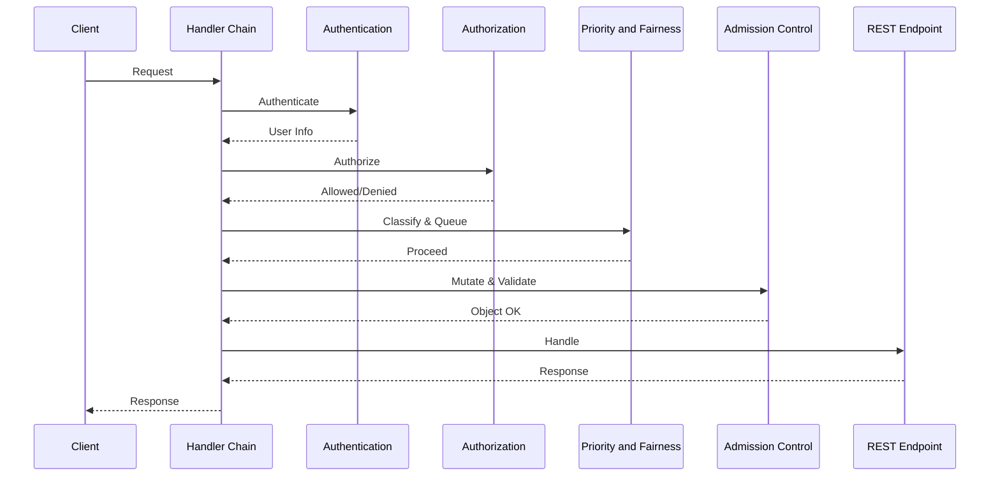
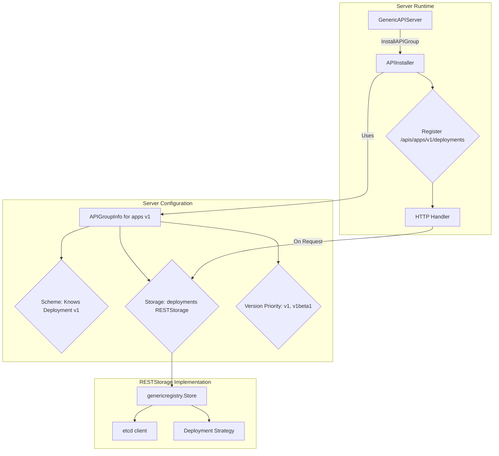

> 🌐 本文档由 [kubernetes/kubernetes](https://github.com/kubernetes/kubernetes) 翻译,英文原版见原项目。
>
> 📝 注:原文超过 10000 字符,本译文覆盖全部核心章节;mermaid 图表代码块保持原样,未做翻译。

# apiserver 架构

## 1. 服务器组合

`kube-apiserver` 二进制并不是单一服务器,而是一条由三个不同 `GenericAPIServer` 实例组成的**服务器链**:核心 Kubernetes API、API 扩展(CRD)以及聚合层。

这一组合由分层的配置系统管理:先是 `options` 结构体(如 `pkg/server/options` 中的 `RecommendedOptions`)解析命令行参数,填充到 `Config` 对象,再用它实例化各个 `GenericAPIServer`。这条委托链的构建逻辑见 `cmd/kube-apiserver/app/server.go` 中的 `CreateServerChain` 函数。

1.  **聚合服务器(Aggregator Server,`kube-aggregator`):**
    *   **用途:** 处理 `apiregistration.k8s.io` API,并充当扩展 API 服务器的反向代理。该功能的设计目标是让第三方 API 可以无缝"聚合"进主 Kubernetes API 服务器。
    *   **机制:** 它监听 `APIService` 对象。当请求到达(例如 `/apis/mycompany.com/v1/myresources`)时,它检查是否有 `APIService` "认领"了该路径。若有,则通过 `ServiceResolver` 找到后端 `Service` 的 IP 并代理该请求。
    *   **使用场景:** 该模式适用于需要自定义业务逻辑(如 `/logs` 这类非 CRUD 子资源)或替代存储后端的、高控制度的编程式扩展。
    *   **委托:** 若没有 `APIService` 匹配,则把请求委托给链上的下一个服务器。

2.  **Kube API 服务器(核心):**
    *   **用途:** 提供所有内建的 Kubernetes API(`core/v1`、`apps/v1` 等)。
    *   **机制:** 这是主服务器,配置了全部核心 REST 存储策略。
    *   **委托:** 若请求的路径不是核心 API(例如是 CRD),则委托给链上的下一个服务器。

3.  **API 扩展服务器(`apiextensions-apiserver`):**
    *   **用途:** 处理 `apiextensions.k8s.io` API,管理 `CustomResourceDefinition`(CRD)对象。CRD 从简单扩展机制演化为带校验、版本化与默认值填充的成熟体系的历程,记录在一系列 KEP 中,起点是 Kubernetes v1.16 的 GA 毕业。
    *   **机制:** 当创建一个 CRD 时,该服务器会动态创建并安装新资源对应的 REST 存储处理器,使其立即可用。
    *   **使用场景:** CRD 是最常见的扩展模式,提供声明式、基于 schema 的方式来定义新的资源类型,存储在 etcd 中,无需自定义 API 服务器代码。
    *   **委托:** 它是链的末端。若无法处理请求,则返回 `404 Not Found`。

## 2. 处理器链

每个请求都会经过一条标准的 HTTP 处理器(过滤器)链。请求体只有在通过认证与授权之后才会被反序列化。默认处理器链由 `staging/src/k8s.io/apiserver/pkg/server/config.go` 中的 `DefaultBuildHandlerChain` 函数构建。

处理器链包含以下阶段:

1.  **认证(`pkg/authentication`):** 该过滤器识别用户身份。认证系统是可插拔的,由多个认证器组成(如客户端证书、Bearer Token、OIDC)。用户身份由链上第一个成功识别用户的认证器确定。
2.  **授权(`pkg/authorization`):** 该过滤器检查用户是否有权执行该操作。授权系统同样可插拔,由多个授权器组成(如 RBAC、Node、Webhook)。每个授权器可以给出允许、拒绝或不表态三种响应;若不表态,请求继续交给链上的下一个授权器。
3.  **优先级与公平性(`pkg/util/flowcontrol`):** 该子系统管理请求并发,把请求归类到 `FlowSchema` 与 `PriorityLevel`,防止过载。引入该特性是为了避免高流量压垮 API 服务器,并确保关键集群操作不被"饿死"。
4.  **准入控制(`pkg/admission`):** 这是策略执行的主要机制。只有在这一阶段,请求体才会被反序列化为对象。准入控制是一条可以变更(mutate)或校验(validate)对象的插件链。内建的 Pod Security 准入控制器是典型例子,它在命名空间级别执行 Pod 安全标准。
5.  **REST 端点处理(`pkg/endpoints`):** 请求最终被分派到对应的 REST 处理器,这些处理器由 `APIInstaller` 安装。

## 3. API 组注册

引入一个 API 的高层步骤如下:

1.  **定义类型:** 在对应 API 组的 `types.go` 中创建或修改 Go 结构体。
2.  **生成代码:** 使用 Kubernetes 项目提供的代码生成器,生成深拷贝、转换、默认值填充所需的样板方法。
3.  **实现 `Strategy`:** 在资源的 `Strategy` 对象中编写自定义业务逻辑与校验。
4.  **注册并安装:** 创建 `APIGroupInfo` 结构体,把 `Scheme` 与配置好 `Strategy` 的存储打包在一起,传给 `GenericAPIServer` 的 `InstallAPIGroup` 方法。

### API 组注册表

`runtime.Scheme` 充当 API 组类型信息的中央注册表。每个 API 组创建一个 `Scheme` 对象,负责以下关键能力:

*   **类型注册与映射:** `Scheme` 的首要职责是在 GroupVersionKind(GVK)与对应 Go 类型之间建立双向映射。该过程还依赖 `deepcopy-gen` 工具为每个类型生成 `DeepCopy()` 方法,这对于保证从缓存返回的对象绝不被直接修改至关重要。

*   **API 转换:** `Scheme` 保存不同 API 版本之间转换对象的转换函数。这些函数通常由 `conversion-gen` 工具生成,支撑 **hub-and-spoke(中心-辐条)** 模型。

*   **默认值填充:** `Scheme` 注册为对象可选字段填充默认值的函数,这些函数通常由 `defaulter-gen` 工具生成。

*   **声明式校验:** `Scheme` 可以存储并执行代码生成的校验函数,提供基线级别的校验。这与主要的、手写的业务逻辑校验不同,后者由 `Strategy` 对象负责。

### `APIGroupInfo` 结构体与 `Strategy` 对象

`Scheme` 填充完毕后,把 `Scheme`、存储后端与版本信息打包进 `APIGroupInfo` 结构体,即可向 `GenericAPIServer` 注册该 API 组。

注册流程如下:

1.  **构建 `APIGroupInfo`:** 为每个 API 组创建一个 `APIGroupInfo` 结构体,内含已填充的 `Scheme`、"资源 → 存储实现"的映射表,以及有序的**版本优先级**列表。

2.  **实例化 REST 存储:** 为每个资源创建一个 `genericregistry.Store`,并为其配置资源专属的 `Strategy` 对象,后者承载核心业务逻辑(如手写校验)。

3.  **安装 API 组:** `GenericAPIServer` 的 `InstallAPIGroup` 方法接收 `APIGroupInfo`,并借助 `APIInstaller` 把资源暴露为 HTTP 端点。

## 4. Watch 缓存

为了在不压垮 etcd 的前提下承接控制器海量的 watch 请求,apiserver 使用了 **watch 缓存**。实现位于 `staging/src/k8s.io/apiserver/pkg/storage/cacher/`。

*   **初始化:** cacher 先执行一次 `LIST` 获取所有对象的当前状态及该时间点的 `ResourceVersion`,然后从该版本开始 `WATCH`,保证事件流的一致性。
*   **从缓存服务:** 大多数 list 与 watch 请求都由这个内存缓存提供服务,显著降低 etcd 负载。一致性读也从缓存服务:服务器先从 etcd 获取最新写入的 revision 号,然后确保缓存至少新鲜到该版本(必要时等待缓存刷新),再处理请求。
*   **回退到存储:** 若客户端请求无法由缓存缓冲区满足,则"穿透"到底层的 etcd 存储。
*   **Bookmark:** cacher 利用 bookmark 事件跟踪未变更对象的最新 `ResourceVersion`,防止缓存的 `ResourceVersion` 变得过旧,从而在对象未修改时避免代价高昂的 etcd relist 操作。

## 5. 冲突解决

*   **基于 `resourceVersion` 的乐观并发:** 客户端应采用"读取-修改-写回"的工作流执行更新。apiserver 利用每个对象的 `resourceVersion` 字段实现乐观并发控制。`resourceVersion` 不是任意数字,它直接映射到 etcd 全局一致的 `mod_revision`。客户端提交更新(`PUT` 或 `PATCH`)时,必须提供其修改所基于对象的 `resourceVersion`。若服务器上的 `resourceVersion` 与 etcd 中当前的 `mod_revision` 不匹配,服务器将以 `409 Conflict` 错误拒绝请求,迫使客户端重新读取对象、解决冲突,并用新的 `resourceVersion` 重新提交。
*   **Server-Side Apply:** 一种声明式、"基于意图"的补丁机制。服务器在对象 metadata 中维护 `managedFields` 区块,跟踪每个字段由哪个"manager"(如某个控制器)拥有。这使多个参与者可以管理同一对象的不同部分而互不覆盖。

## 6. 发现与 OpenAPI

API 服务器提供 `/apis` 发现端点以及 `/openapi/v2`、`/openapi/v3` 规范。OpenAPI 规范的生成是一个多阶段过程。

*   **`openapi-gen`**:该工具反射 Go 结构体、读取 godoc 注释并检查校验 struct tag,生成所有 API 定义的映射表。
*   **`zz_generated.openapi.go`**:输出是一个大型 Go 文件,包含 `GetOpenAPIDefinitions` 函数。
*   **运行时**:`GenericAPIServer` 调用这个生成的函数,构建最终对外提供的 OpenAPI JSON 规范。

## 7. 安全与可观测性

*   **审计(`pkg/audit`):** apiserver 有一套由策略驱动的事件日志管道。审计策略控制记录什么内容、在请求的哪个阶段记录。
*   **安全:**
    *   **mTLS:** 系统组件间的主要认证机制。
    *   **ServiceAccount Token 签发:** `kube-apiserver` 充当 OIDC 提供方,为 `ServiceAccount` 签发并校验 JWT。

## 8. 流式协议

*   **Websocket:** apiserver 使用 websocket 将 HTTP 连接升级为交互式流式协议,用于 `exec`、`attach`、`port-forward` 等场景。`UpgradeAwareProxyHandler` 负责管理这一过程。
