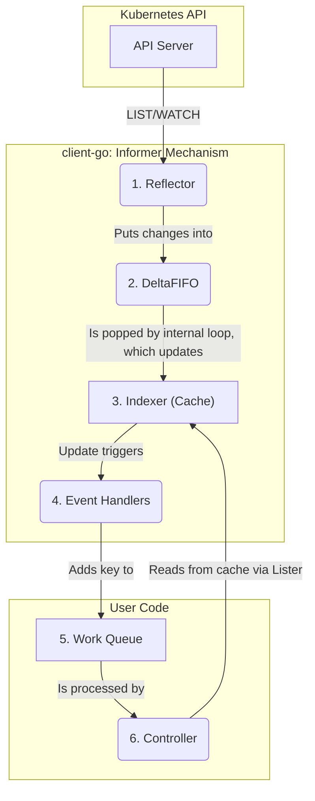

> 🌐 本文档由 [kubernetes/kubernetes](https://github.com/kubernetes/kubernetes) 翻译,英文原版见原项目。

# `client-go` 架构

本文面向贡献者讲解 `client-go` 的内部架构,内容包括主要组件、组件间的交互方式,以及决定该库形态的关键设计决策。

## 客户端配置

加载客户端配置与使用配置在架构上是分离的。`rest.Config` 对象是配置在内存中的表示,`tools/clientcmd` 包是生成它的标准工厂。`clientcmd` 负责解析 `kubeconfig` 文件、合并 context、处理外部认证提供方(如 OIDC)等复杂逻辑。

## REST 客户端

`rest.Client` 是支撑所有其他客户端的基础 HTTP 客户端。它把 HTTP 传输、序列化、错误处理这些底层关注点,与上层的 Kubernetes 特有对象逻辑分离开来。

`rest.Config` 对象用于构建底层 HTTP 传输层,它通常是一条 `http.RoundTripper` 对象链。链上的每个元素负责一项特定任务,例如添加 `Authorization` 头。所有认证信息都是通过这一机制注入请求的。

客户端对请求采用构建器模式(如 `.Verb()`、`.Resource()`),把响应处理推迟到调用 `.Into(&pod)` 之类的方法时才进行。这种分离是在同一基础上支撑多种客户端模型的关键。

### 端点交互

*   **内容协商:** 客户端通过 HTTP `Accept` 头协商传输格式(JSON 或 Protobuf)。基于该机制的一个重要性能优化,是可以通过 `as=PartialObjectMetadata;g=meta.k8s.io;v=v1` 这一 Accept 自定义参数请求仅含元数据的对象。此外,`as=Table;g=meta.k8s.io;v=v1` 自定义参数可用于请求以表格形式返回列表。
*   **子资源:** 客户端可以针对 `/status`、`/scale` 等标准子资源执行对象变更,也能处理 `/logs`、`/exec` 这类面向动作的子资源,后者通常涉及流式数据。
*   **列表分页:** 对于 `LIST` 请求,客户端可以指定 `limit`。服务端最多返回该数量的条目;若还有更多,会附带一个 `continue` 令牌。客户端需要在后续请求中携带该令牌来获取下一页。`Reflector` 的 `ListerWatcher` 等更高层的工具会自动处理这一逻辑。
*   **流式 Watch:** `WATCH` 请求返回一个 `watch.Interface`(来自 `k8s.io/apimachinery/pkg/watch`),它提供一条结构化 `watch.Event` 对象的通道(`ADDED`、`MODIFIED`、`DELETED`、`BOOKMARK`)。这将 watch 的消费方与底层流式协议解耦。

### 错误、警告与限速

*   **结构化错误:** 客户端把非 2xx 响应反序列化为结构化的 `errors.StatusError`,从而支持程序化的错误处理(如 `errors.IsNotFound(err)`)。
*   **警告:** 客户端通过 `WarningHandler` 处理来自 API 服务器的非致命 `Warning` 头。
*   **客户端限速:** `rest.Config` 中的 `QPS` 与 `Burst` 设置,是客户端一侧与服务端 API Priority and Fairness 体系对应的契约。
*   **服务端节流:** 客户端的默认传输层会自动处理 HTTP `429` 响应:读取 `Retry-After` 头、等待,然后重试请求。

## 类型化客户端与动态客户端

为应对 Kubernetes API 的可扩展特性,`client-go` 提供两种主要的客户端模型。

**`kubernetes.Clientset`** 为核心内建 API 提供编译期、类型安全的访问。

**`dynamic.DynamicClient`** 将所有对象都表示为 `unstructured.Unstructured`,因此可以与任何 API 资源(包括 CRD)交互。它依赖两种发现机制:
1.  **`discovery.DiscoveryClient`** 用于确定*存在哪些*资源。**`CachedDiscoveryClient`** 是一种优化,它把这些数据缓存到磁盘上。
2.  **OpenAPI schema**(从 `/openapi/v3` 获取)描述这些资源的*结构*,为动态客户端提供所需的模式感知能力。

## 代码生成

`client-go` 的一条核心架构原则是使用代码生成,为特定的 API GroupVersion 提供强类型、编译期安全的接口。这让控制器代码更健壮、更易维护。`k8s.io/code-generator` 中的工具会生成几个关键组件:

*   **类型化 Clientset:** 与特定 GroupVersion 交互的主要接口。
*   **类型化 Lister:** 控制器使用的只读、缓存访问器。
*   **类型化 Informer:** 为特定类型填充缓存的机制。
*   **Apply 配置:** 用于 Server-Side Apply 的类型安全构建器。

修改内建 API 类型的贡献者**必须**运行代码生成脚本来更新所有这些依赖组件。对 Kubernetes 项目而言,`hack/update-codegen.sh` 负责运行代码生成。

`sample-controller` 展示了如何配置代码生成来构建自定义控制器。

## 控制器基础设施

`tools/cache` 包为控制器提供核心基础设施,用低负载、事件驱动、基于缓存的模型取代高负载的基于请求的模式。

数据流如下:

**`Reflector`** 先执行一次 `LIST` 获取某个资源在特定 `resourceVersion` 下的一致性快照,然后从该 `resourceVersion` 开始 `WATCH`,持续接收后续变更。`Reflector` 的 relist/rewatch 循环旨在通过重新 List 来解决 **"too old" `resourceVersion` 错误**。为了让这种恢复更高效,`Reflector` 会消费来自服务端的 **watch bookmark**,从中获得更新的 `resourceVersion` 作为重启点。

**`Lister`** 是控制器的业务逻辑访问 `Indexer` 缓存的主要只读、线程安全接口。

## 控制器模式

控制器基础设施在架构上与控制器的业务逻辑解耦,以保证健壮性。

**`util/workqueue`** 在事件检测(informer 的职责)与调谐 reconciliation(控制器的职责)之间建立了关键边界。informer 的事件处理器只把对象的 key 加入工作队列。这使控制器可以带指数退避地重试失败操作,而不会阻塞 informer 的 watch 流。

在高可用方面,**`tools/leaderelection`** 包提供了标准架构方案:让多个副本竞争获取共享 `Lease` 对象上的锁,从而保证"单一写入者"语义。

## Server-Side Apply

`client-go` 为对象变更提供了一种与服务端声明式模型对齐的独特架构模式。它与传统的 `get-modify-update` 模式是分开的工作流,后者允许多个控制器安全地共同管理同一对象。**`applyconfigurations`** 包提供了生成的、类型安全的构建器 API,用于构造声明式补丁。

## 版本与兼容性

`client-go` 与 Kubernetes 主仓库之间存在严格的版本对应关系:`client-go` 的 `v0.X.Y` 版本对应 Kubernetes `v1.X.Y` 版本。

Kubernetes API 有很强的向后兼容保证:用旧版 `client-go` 构建的客户端可以配合新版 API 服务器工作。但反之并无保证。贡献者绝不能破坏对受支持版本 Kubernetes API 服务器的兼容性。
